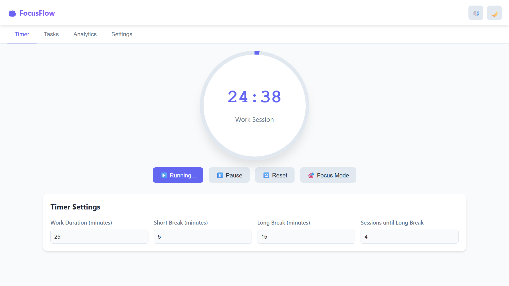
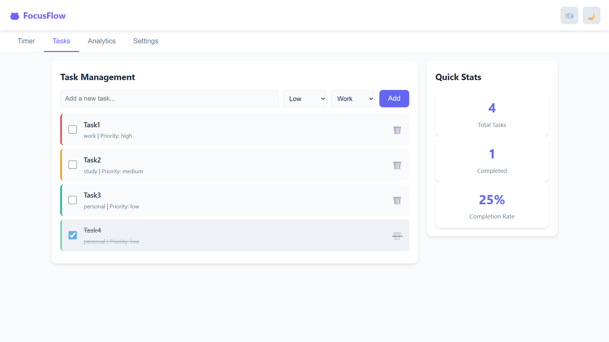
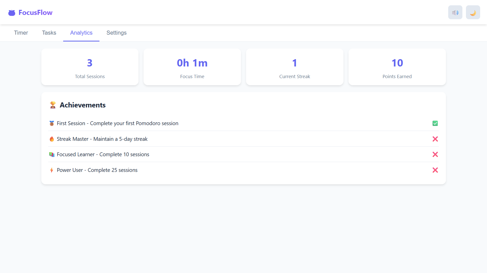
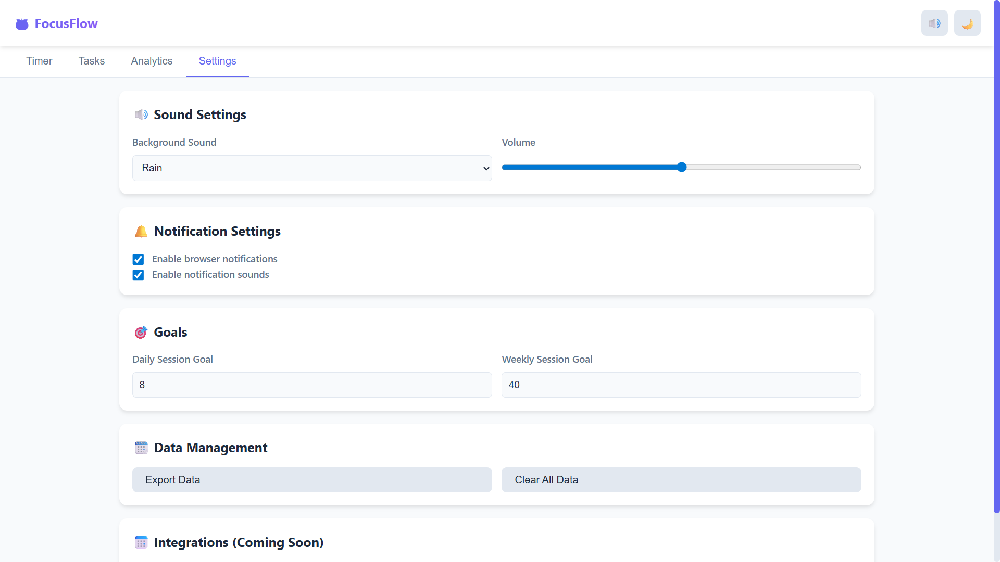

# TaskManagement App

Not just a simple Task Management App But A powerful and intuitive productivity app designed to help you stay focused, organized, and motivated in your daily life. Whether you're working, studying, or managing personal tasks, this app has everything you need to achieve your goals.

---

## 🖼️ How the app looks like
### Main Page(Pomodoro Timer)
 
### Task(todo list)

### Analytics + Rewards Tokens

### Settings

---

## 🚀 Features

### 🕒 Pomodoro Timer
- **Customizable Pomodoro Timer:** Fully customizable work sessions with short and long breaks.
- **Focus Mode:** Minimize distractions and maximize productivity.
- **Background Sounds:** Choose from rain, forest, cafe noise, or ocean sounds to help you focus.

### ✅ To-Do List
- **Task Management:** Add, edit, and delete tasks.
- **Labels:** Organize tasks by labels such as Work, Study, and Personal.
- **Priorities:** Set task priorities (Low, Medium, High). Tasks with the highest priority appear at the top.
- **Smart Sorting:** Automatically sorts and keeps your most important tasks visible.

### 📊 Dashboard
- **Task Overview:** View the total number of tasks and completed tasks at a glance.

### 📈 Analytics
- **Sessions Tracking:** Dashboard showing total sessions, total focus time, daily streaks, and points earned.

### 🏆 Achievements
- **Achievement Tokens:** Earn tokens for reaching specific productivity goals.

### ⚙️ Settings
- **Background Sound & Volume:** Personalize your focus experience with different sounds and adjustable volume.
- **Session Goals:** Set daily and weekly session goals to stay on track.
- **Notifications:** Option to turn off website notifications.
- **Data Management:** Export your data or clear all website data with a single click.

### 📅 Upcoming: Google Calendar Integration
- **Sync Tasks with Google Calendar:** Coming soon!

---
